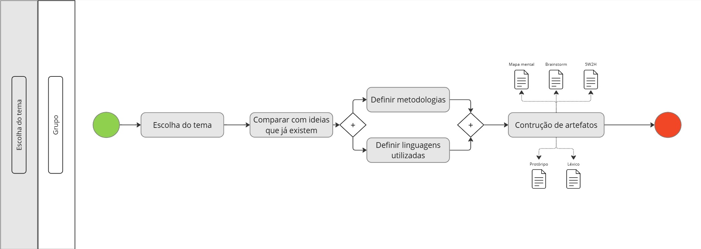

# Diagrama Bpmn
## Introdução
O BPMN é uma notação padrão que emprega símbolos e técnicas de modelagem que ajudam a compreender e trocar modelos de processos. É útil para gerentes de projeto e analistas de negócios, pois pode ajudá-los a: 
* a) entender visualmente como um processo está funcionando; 
* b) determinar o que é que o processo deve abranger; 
* c) prever os resultados desejados; 
* d) agilizar a comunicação e a colaboração; 
* e) maximizar a eficiência e 
* f) identificar oportunidade para melhorias.

## Objetivos

## Versões 1.0

### Escolha do tema

### Autor: [Lucas Macedo](https://github.com/Luckx98)

## Referências 

* O que é BPMN? Como fazer o Diagrama? Modelos e Exemplos. Disponível em: <https://miro.com/pt/diagrama/o-que-e-bpmn/>. Acesso em: 2 nov. 2024.
* BPMN (Modelo e Notação de Processos de Negócio) | Microsoft Visio. Disponível em: <https://www.microsoft.com/pt-br/microsoft-365/visio/business-process-modeling-notation>. Acesso em: 2 nov. 2024.

## Histórico de versão
| Versão |    Data    |      Descrição      |                                                                                              Autor(es)            | Revisor |
| :----: | :--------: | :-----------------: | :--------------------------------------------------------------------------------------------------------------------------------------------------------------------------------------------------: | :----: |
| `1.0`  | 02/11/2024 | Criação do artefato BPMN | [Lucas Macedo](https://github.com/Luckx98) |  |