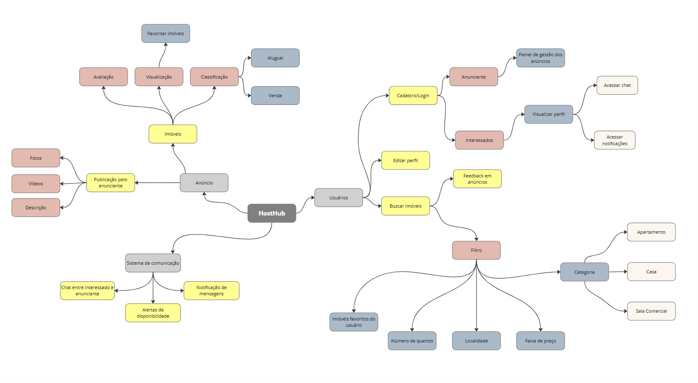

# Mapa mental 

## Introdução

Os mapas mentais são ferramentas visuais que facilitam a organização e compreensão de requisitos em projetos, como os [Usuários](./lexicos.md?id=l04-usuário) e necessidades dos [Imóveis](./lexicos.md?id=l02-imóvel), e outras funcionalidades, como [Cadastro de Usuário](./lexicos.md?id=l07-cadastro-de-usuário) e [Reserva](./lexicos.md?id=l09-reserva). Eles permitem uma representação clara das inter-relações entre os requisitos, ajudando a equipe a identificar prioridades e dependências. Essa técnica sintetiza informações complexas em um formato acessível, promovendo uma comunicação eficiente entre os membros da equipe e stakeholders. Ao facilitar a visualização das funcionalidades necessárias, os mapas mentais contribuem significativamente para o sucesso do desenvolvimento, assegurando que as necessidades dos usuários sejam atendidas de forma eficaz.

## Imagem

        
* Feito pelos alunos

## Navegação

<iframe width="768" height="432" src="https://miro.com/app/live-embed/uXjVLK84b0g=/?moveToViewport=-3122,-1548,4072,1842&embedId=267232619438" frameborder="0" scrolling="no" allow="fullscreen; clipboard-read; clipboard-write" allowfullscreen></iframe>

## Referências 

* FIA. "Mapas mentais: benefícios, como construir, dicas e modelos." Disponível em: https://fia.com.br/blog/mapas-mentais-beneficios-como-construir-dicas-e-modelos/
* Lucidchart. "Mapa Mental: o que é e como fazer [com Vídeo e Exemplos]." Disponível em: https://www.lucidchart.com/pages/pt/o-que-e-mapa-mental-e-como-fazer
* ETALENT. "Mapa mental: o que é, como construir e modelos." Disponível em: https://etalent.com.br/artigos/treinamento-e-desenvolvimento/mapas-mentais/
* Estudar Fora. "Como fazer um mapa mental, técnica de organização e memorização." Disponível em: https://www.estudarfora.org.br/mapa-mental/

## Histórico de versão

| Versão |    Data    |           Descrição           |                                                            Autor(es)                                                            | Revisor |
| :----: | :--------: | :---------------------------: | :----------------------------------------------------------------------------------------------------------------------------: | :-----: |
| `1.0`  | 02/11/2024 | Criação do artefato Mapa mental | [Lucas Macedo](https://github.com/Luckx98), [Ester Lino](https://github.com/esteerlino), [Gabriel Bertolazzi](https://github.com/Bertolazi) |         |
| `1.1`  | 04/11/2024 | Lincagem de palavras aos léxicos      | [Miguel Moreira](https://github.com/EhOMiguel), [Arthur Trindade](https://github.com/trindadea)                                 |         |
